# DELICIOUS SANDWICHES: A Java CLI Application
## ________________________________________________________
## Overview

### Features
- **Order Your Food Option:** The Customer can order a custom sandwich or signature sandwich from the menu. 
- **Customer Name and Email:** The customer can enter their name and email address to personalize their order. 
- **Order Screen** Customer can view their order summary, including the sandwich details, price, and order number.
- **Custom Sandwich and Premium Sandwich**  Customer can choose to order a custom sandwich or a premium sandwich from the menu.

## ________________________________________________________
## UML Class Diagram

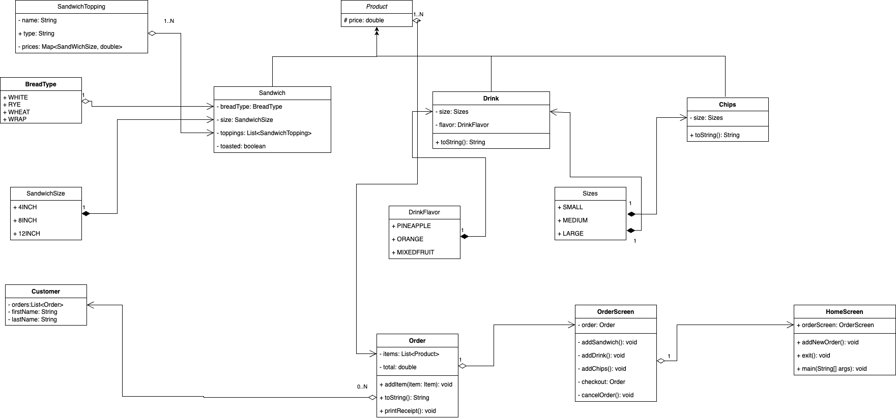

## ________________________________________________________

### Purpose
The DELI-cious project is designed to create a customizable sandwich shop application where users can place orders for sandwiches, drinks, and chips.

### Motivation and Target Audience
The motivation behind the DELI-cious project is to develop an engaging and interactive application that simulates a real-world ordering system for a sandwich shop

## Application Home Screen
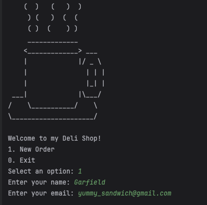

The customer is presented with a home screen and asked to start a new order. Then the customer is prompted to enter his name. The name is stored and used to personalize the customer's experience throughout the application. The customer can perform various actions from the home screen by selecting an option from the dropdown menu.

### Click on the dropdown to see the features of the application. Each feature is explained by prompting the customer to enter the necessary details to perform the task.
You can perform the following actions from the home screen:

**
 Order Screen 
**

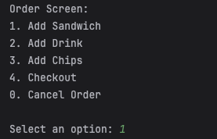

#### The Customer is presented with a home screen and asked to enter his name. The name is stored and used to personalize the customer experience throughout the application. The customer can perform various actions from the home screen by selecting an option from the dropdown menu.

 Add Sandwich 

#### Customer can add a sandwich to his order. Customer chooses to add a sandwich from the menu. Then the customer is prompted to choose the type of sandwich he wants to add. 
The customer can choose to add a custom sandwich or a premium sandwich.

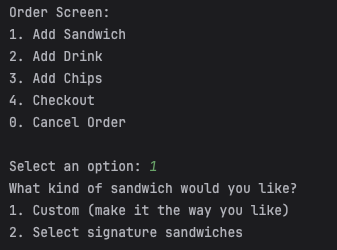

 Add Custom Sandwich  

#### Customer chooses to add a custom sandwich. The customer is prompted to enter the type of bread, size, and toppings for the sandwich. The customer can add multiple toppings to the sandwich.
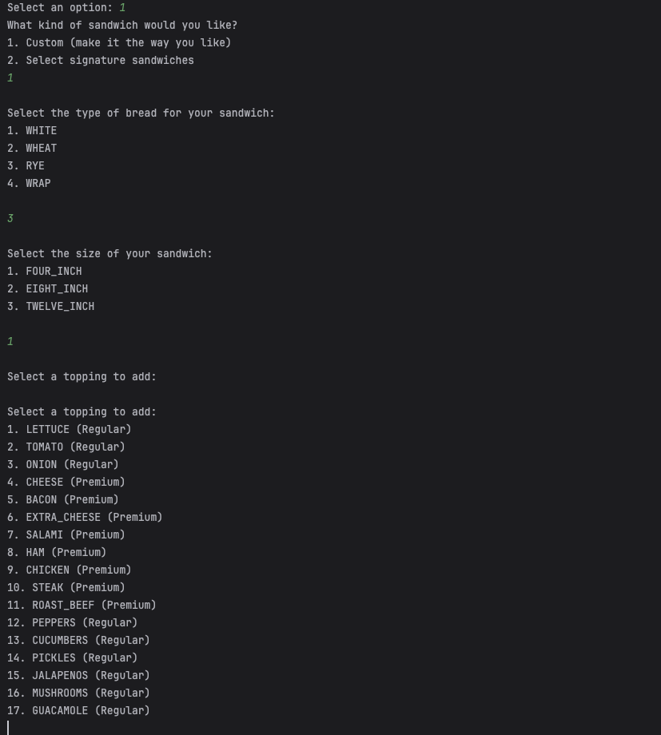

 Add Multiple Toppings 

#### Customer can add multiple toppings to the sandwich. The toppings are categorized as premium and regular toppings. The customer can choose to add multiple toppings from the premium and regular toppings list.
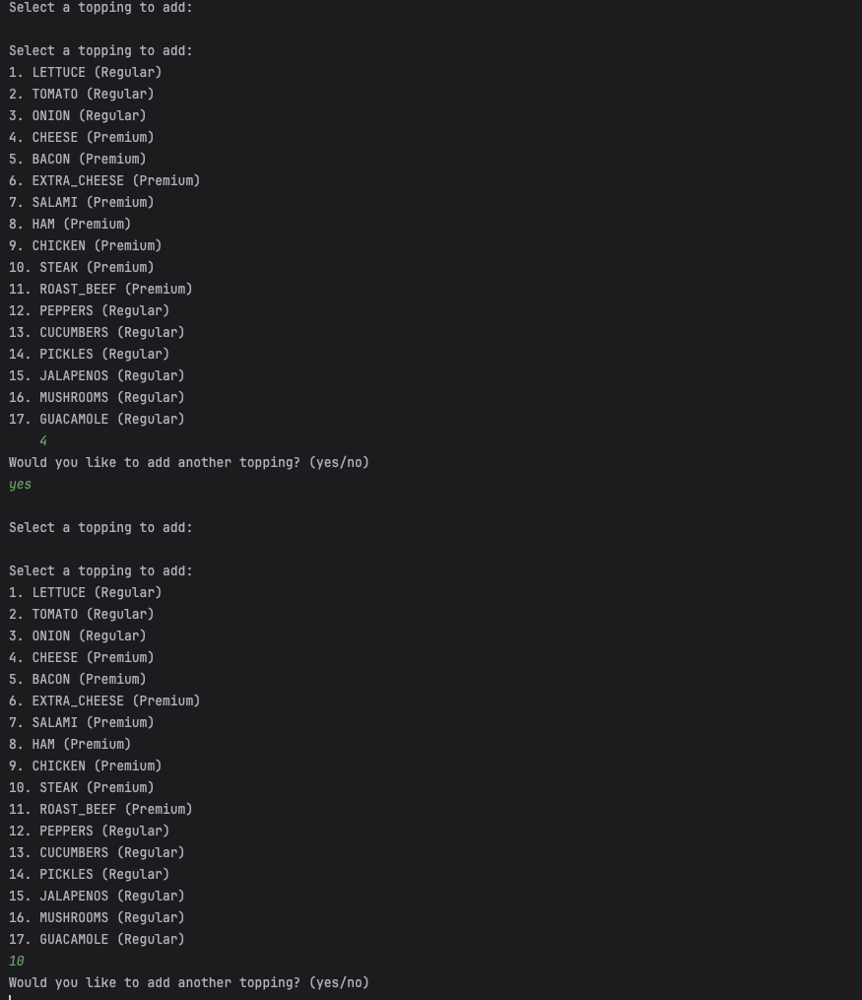

 Toasted Option and Added to the Order 

#### Customer can choose to have the sandwich toasted. The customer is prompted to choose if he wants the sandwich toasted. The sandwich is then added to the order.
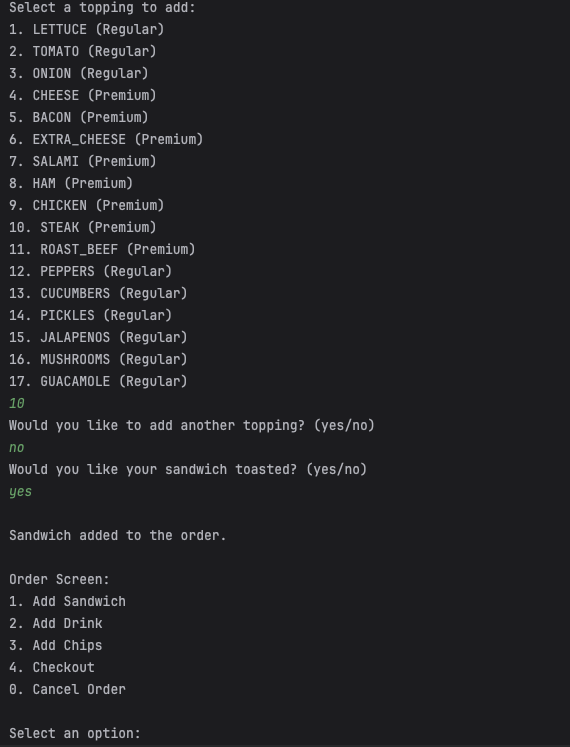

 Add Drink 

#### Customer can add a drink to his order by choosing its size and flavor then the drink is added to the order.
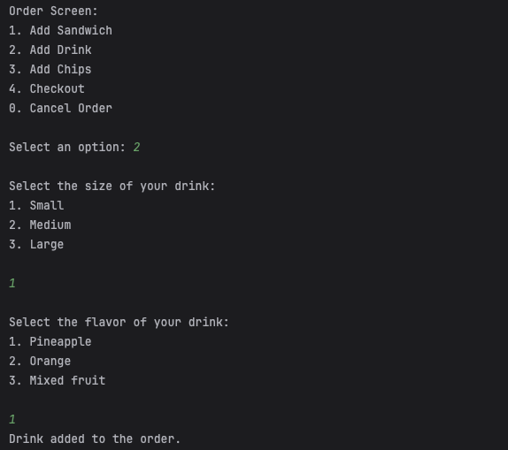

 Add Chips 

#### Customer can add chips to his order by choosing size and then the chips are added to the order.
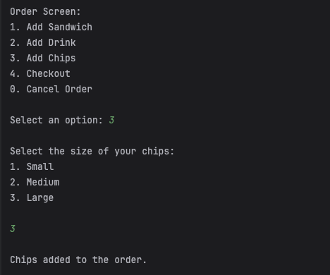

 Checkout 

#### The customer can check out and view their order summary. They are then asked to confirm their order. Once confirmed, the customer is presented with the message "Order Confirmed" along with their name and receipt number, as well as the current date and time.
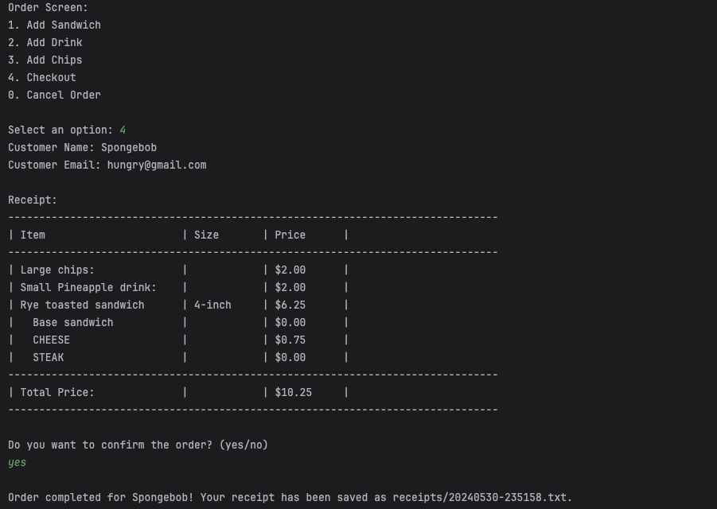

 Exit 

#### The customer can exit the application by selecting the exit option from the dropdown menu. The customer is then presented with the message "Goodbye" and the application closes.
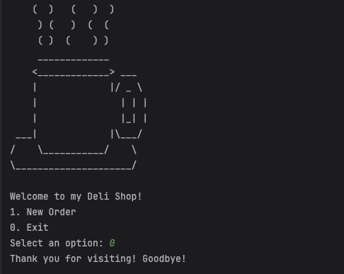

 Cancel Order 

1. #### Clearing the Order:
The cancelOrder method clears the current order, removing any items that the user may have added. This ensures that if the user decides to start a new order later, they won't see items from the canceled order.

2. #### User Feedback:
After clearing the order, the method prints a message to inform the user that their order has been canceled. This feedback is important for user experience, as it confirms that the action was successful.

3. #### Returning to Home-Screen:
The method might also include logic to return the user to the home screen or main menu, depending on how the application is structured. In this example, it calls a hypothetical displayHomeScreen method to handle this transition.

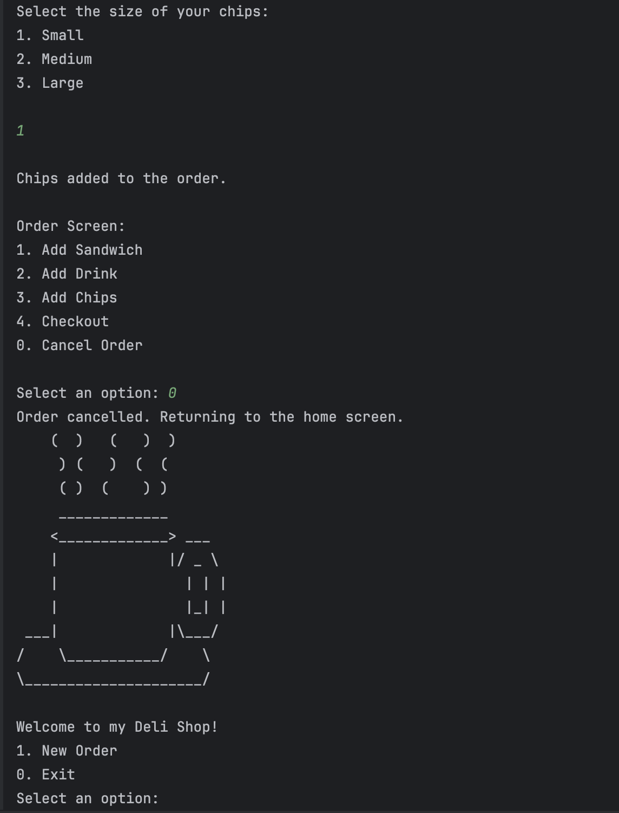

## ________________________________________________________

## Error Handling
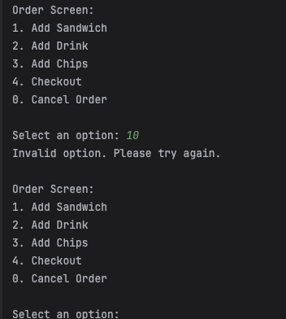

#### Anytime the customer enters an invalid command, an "invalid command" message will show up, and the customer will have to try again and enter a valid command.

## ________________________________________________________
## Interesting Piece of Code
### Interesting Code Snippet: Order Processing
One of the most fascinating parts of the Delicious sandwich project is the startOrder method. This method is pivotal as it manages the entire order process, showcasing several key aspects of the application's functionality and design.
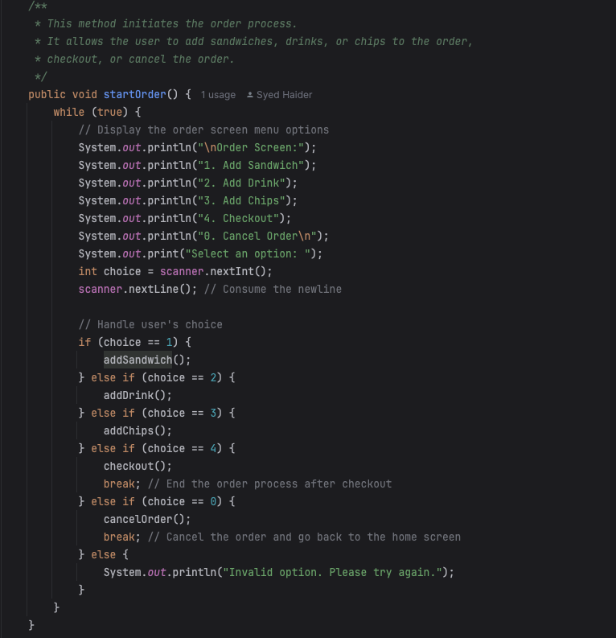

#### Why This Code is Interesting:

1. #### User Interaction: 
The startOrder method is the primary interface for user interaction, presenting a menu-driven system that allows users to make selections and interact with the application seamlessly.

2. #### Modular Design: 
The method demonstrates a modular approach to functionality. Each menu option calls a specific method (addSandwich, addDrink, addChips, checkout, cancelOrder), making the code easy to understand, maintain, and extend.

3. #### Control Flow: 
The use of a while (true) loop for continuous interaction until the user decides to checkout or cancel the order provides a clear and straightforward flow of control.

4. #### User Experience:
The method ensures a positive user experience by validating input and providing feedback for invalid options, ensuring users are guided through the process without confusion.

5. #### Encapsulation of Order Logic:
By encapsulating the order initiation logic within a single method, the code maintains a clear separation of concerns, enhancing readability and maintainability.

